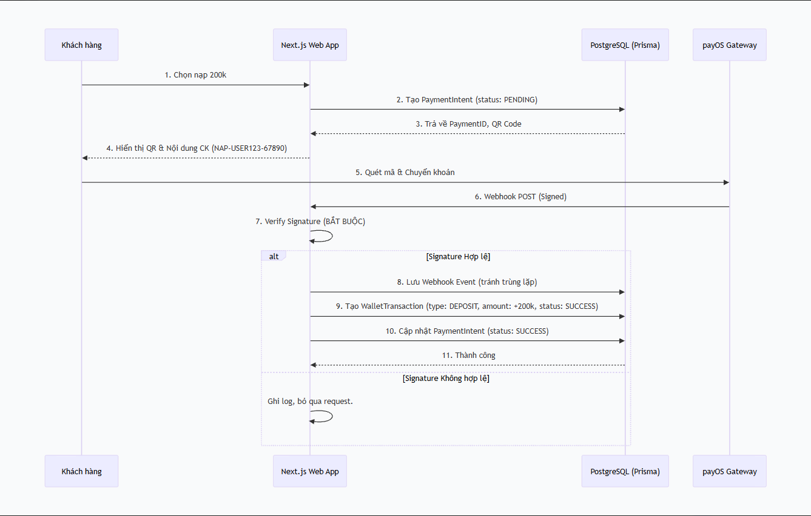
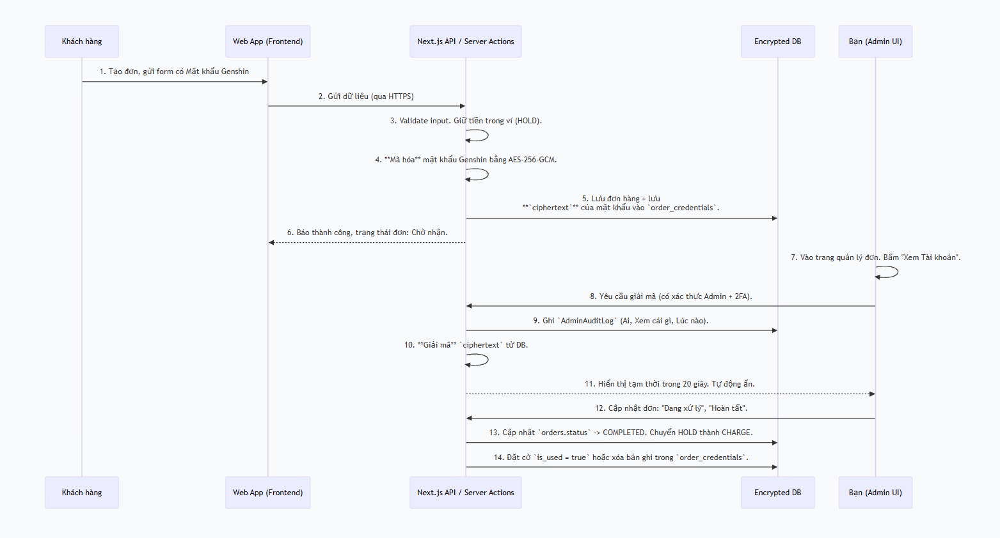

Tầm nhìn Sản phẩm & Nguyên tắc Cốt lõi
Chúng ta không chỉ xây một công cụ nhận đơn, mà là một Nền tảng Dịch vụ Game chuyên nghiệp và tin cậy. Mọi quyết định thiết kế sẽ xoay quanh 3 trụ cột:

Trải nghiệm Khách hàng (UI/UX) Tuyệt vời: Quy trình đặt đơn, nạp tiền phải mượt mà, trực quan, đẹp mắt, tạo dựng lòng tin tuyệt đối.

Bảo mật và An toàn Dữ liệu là Tối thượng: Ví tiền là sổ cái bất biến, tài khoản game của khách là tài sản được bảo vệ nghiêm ngặt nhất.

Vận hành Tinh gọn và Minh bạch: Quy trình rõ ràng, có log, có đối soát. Không bưng bít, không làm tắt.

Về việc "hash" mật khẩu Genshin, tôi xin nhấn mạnh lại như bạn đã phân tích: Đó là sai lầm chết người về kỹ thuật. Hash là hàm một chiều, dùng cho xác thực. Chúng ta cần đọc lại mật khẩu để đăng nhập hộ khách, nên bắt buộc phải dùng Mã hóa hai chiều (Encryption) với quy trình giải mã cực kỳ kiểm soát.

Kiến trúc Hệ thống & Luồng Dữ liệu Đề xuất
Dưới đây là bản thiết kế chi tiết, cụ thể hóa những gì bạn đã vạch ra, phù hợp với stack Next.js, PostgreSQL, Prisma.

1. Sơ đồ Quy trình Nạp tiền & Ví (Ledger)
Đây là phần quan trọng để chống gian lận ngay từ đầu.

2. Quy trình Xử lý Đơn hàng & Bảo mật Tài khoản
Đây là luồng tối ưu cho UX của khách và sự an toàn của dữ liệu.

Lộ trình Phát triển Chi tiết (Checklist Chuyên sâu)
Chúng ta sẽ đi theo đúng lộ trình của bạn, tập trung vào UI/UX trước, nhưng thiết lập nền tảng back-end đúng đắn song song.

Giai đoạn A: Thiết lập Nền móng & UI Tĩnh (Static UI/UX)
Mục tiêu: Hoàn thiện 100% giao diện người dùng cuối và admin, có thể click qua lại, nhập liệu, nhưng chưa có logic back-end thật. Sử dụng mock data.

Khởi tạo Project: npx create-next-app@latest với TypeScript, Tailwind CSS, App Router.

Setup UI Foundation:

npx shadcn-ui@latest init: Cài đặt thư viện UI.

Cấu hình theme (màu chủ đạo, dark/light mode).

Cấu hình Font chữ (ví dụ: Inter cho UI, một font khác cho heading).

Tạo các components Layout chung.

Thiết kế và Code Trang Khách hàng (Tĩnh):

Landing Page (/): Hero section nổi bật, danh sách dịch vụ, lời chứng thực (mock), CTA "Đặt dịch vụ ngay".

Bảng giá (/services): Thiết kế dạng card hoặc bảng. Có tag "Phổ biến", "Giảm giá". Bấm vào dẫn đến trang tạo đơn.

Trang Tạo đơn (/order/create):

Thiết kế dạng Wizard (các bước) hoặc một form dài có phân vùng rõ ràng.

Bước 1: Chọn game (nếu sau này mở rộng), server, UID.

Bước 2: Chọn dịch vụ, gói cước (kéo từ mock data).

Bước 3: Form cực kỳ quan trọng "Thông tin đăng nhập tạm thời". Thiết kế UI/UX ở đây phải toát lên sự bảo mật:

Ô input Email/Tài khoản.

Ô input Mật khẩu Game với nút ẩn/hiện.

Checkbox bắt buộc: "Tôi đã đọc và đồng ý với Điều khoản & Cảnh báo bảo mật".

Khi bấm vào link "Cảnh báo bảo mật", hiển thị modal hoặc popover với nội dung rõ ràng, in đậm: "Không gửi mật khẩu email/backup. Hãy đổi mật khẩu sau khi hoàn tất."

Bước 4: Xác nhận đơn hàng và số dư cần trừ.

Dashboard Khách (/dashboard): Layout sidebar, hiển thị Avatar, tên, số dư. Menu: Tổng quan, Đơn của tôi, Nạp tiền, Lịch sử ví.

Trang Nạp tiền (/dashboard/deposit):

Số dư hiện tại ở trên cùng.

Các nút mệnh giá nhanh (50k, 100k,...).

Ô nhập số tiền tùy chỉnh.

Nút "Tạo mã nạp".

Khu vực hiển thị QR Code (mock ảnh), thông tin ngân hàng (ảo), nội dung CK (tạo fake). Có nút copy nội dung.

Trạng thái thanh toán (mock): Đang chờ -> Thành công/Hết hạn.

Trang Chi tiết Đơn (/dashboard/orders/[id]):

Timeline dọc hiển thị trạng thái.

Khu vực chat/ghi chú với admin.

Khu vực hiển thị ảnh kết quả (nếu có).

Thiết kế và Code Trang Admin (Tĩnh):

Login Admin (/admin/login): Form đăng nhập cơ bản.

Dashboard Tổng quan (/admin): Widget số liệu: Đơn mới hôm nay, Doanh thu, Lợi nhuận.

Quản lý Đơn (/admin/orders):

Bảng filterable (theo trạng thái, dịch vụ).

Nút "Nhận đơn", "Cập nhật tiến độ".

Chi tiết Đơn (Admin): Đây là giao diện quan trọng nhất.

Ô "Thông tin Tài khoản Game": Mặc định hiển thị ••••••••••. Nút "Xem" bên cạnh. Khi bấm, hiện modal xác nhận "Hành động này sẽ được ghi log", sau đó hiện mật khẩu trong ô và tự động ẩn đi sau 20s.

Form cập nhật trạng thái, upload ảnh.

Quản lý Dịch vụ & Bảng giá (/admin/services): Giao diện CRUD để thêm/sửa/xóa/ẩn các dịch vụ và gói giá.

Giai đoạn B: Back-end Cốt lõi & Kết nối Database (Localhost)
Mục tiêu: Biến UI tĩnh thành động. Xác thực, phân quyền, xử lý dữ liệu thật trong database local.

Setup Database: Cài đặt PostgreSQL local, Prisma (schema chính sẽ làm sau, nhưng có thể kết nối thử).

Xác thực (Authentication):

Chọn giải pháp: Auth.js (NextAuth) hoặc tự làm với JWT.

Tạo luồng Đăng ký/Đăng nhập cho Customer.

Bắt buộc: Hash mật khẩu web của khách bằng bcrypt hoặc argon2.

Tạo luồng Đăng nhập riêng cho Admin.

Phân quyền (Authorization):

Định nghĩa các Role: CUSTOMER, ADMIN.

Middleware bảo vệ route: /admin chỉ dành cho ADMIN, /dashboard chỉ dành cho CUSTOMER.

Thiết kế Database Schema (Prisma) & Code:

Code các bảng bạn đã liệt kê, tập trung vào quan hệ và kiểu dữ liệu.

Quan trọng: order_credentials phải có trường encrypted_password (String), view_count (Int), expires_at (DateTime), is_used (Boolean).

Logic Nạp tiền & Ví (Ledger):

Tuyệt đối không có trường balance trong bảng users.

Code API để tạo PaymentIntent.

Code Logic cho WalletTransaction: Hàm tạo giao dịch deposit, hold, charge, refund. Mỗi hàm là một database transaction để đảm bảo tính toàn vẹn.

Code hàm getBalance(userId) bằng cách tính tổng của các WalletTransaction thành công.

Logic Đặt đơn & Bảo mật Tài khoản Game:

Code Server Action/API để tạo đơn hàng.

Quy trình tạo đơn trong 1 Transaction:

Kiểm tra getBalance().
Nếu đủ, tạo WalletTransaction loại HOLD.
Tạo bản ghi Order.
Mã hóa mật khẩu Genshin bằng AES-256-GCM với secret key từ process.env.ENCRYPTION_KEY.
Tạo bản ghi OrderCredential chứa ciphertext.
Tạo OrderStatusLog.
Code API cho Admin "Xem mật khẩu":

Xác thực admin.
Ghi AdminAuditLog.
Giải mã ciphertext từ DB.
Trả về plaintext một lần duy nhất, KHÔNG lưu vào state hay local storage.
Code logic cập nhật trạng thái đơn và chuyển đổi giao dịch ví từ HOLD sang CHARGE khi hoàn tất.

Giai đoạn C: Tích hợp Thanh toán Thật (payOS)
Mục tiêu: Kết nối với payOS Sandbox, hoàn thiện luồng nạp tiền tự động.

Tạo tài khoản payOS Sandbox.

Code Webhook Handler:

Tạo API route nhận POST request từ payOS.

Bước quan trọng nhất: Verify Signature của webhook bằng public key của payOS. Nếu sai, trả về 401 ngay lập tức.

Kiểm tra orderCode có khớp với PaymentIntent trong DB không.

Kiểm tra amount có khớp không.

Kiểm tra Idempotency: Kiểm tra payment_webhook_events xem webhook_id này đã được xử lý chưa để tránh cộng tiền 2 lần.

Nếu tất cả OK, tạo WalletTransaction (DEPOSIT) và cập nhật trạng thái PaymentIntent. Lưu toàn bộ payload gốc vào payment_webhook_events.

Code Frontend cho Nạp tiền:

Kết nối nút "Tạo mã nạp" với API.

Hiển thị QR code động từ dữ liệu trả về.

Dùng kỹ thuật Polling (gọi API kiểm tra trạng thái mỗi 3-5s) hoặc SSE/WebSocket để cập nhật trạng thái "Đã thanh toán" cho khách mà không cần reload trang.

Bản checklist An ninh Trước "Production"
Trước khi bạn nghĩ đến chuyện deploy lên VPS hay Vercel, tất cả những mục này phải được đánh dấu [x]:

Bảo vệ Tài khoản Game:

Mật khẩu Genshin được mã hóa AES-256-GCM trước khi vào DB.

ENCRYPTION_KEY được lưu trong .env, không commit lên git.

Admin bắt buộc phải xác thực lại (hoặc có 2FA) để xem mật khẩu.

Mỗi lần Admin xem mật khẩu, một bản ghi AdminAuditLog được tạo.

Mật khẩu giải mã chỉ được hiển thị tạm thời trên UI, không lưu vào đâu cả.

Có cơ chế tự động xóa hoặc đánh dấu is_used cho OrderCredential sau khi đơn hoàn tất/hủy.

Input của khách được validate kỹ lưỡng để chống XSS.

Bảo vệ Ví & Giao dịch:

Số dư ví là kết quả tính từ WalletTransactions, không phải một trường để UPDATE.

Mọi thay đổi số dư (nạp, giữ tiền, trừ tiền, hoàn) đều phải là một WalletTransaction.

Webhook Thanh toán được verify chữ ký trước khi xử lý.

Có cơ chế chống xử lý trùng lặp webhook (Idempotency).

Admin chỉ được tạo WalletTransaction loại adjustment để sửa số dư, kèm theo lý do và được ghi log.

Bảo vệ Ứng dụng Web:

Tất cả API/Server Actions nhạy cảm đều kiểm tra Authentication & Authorization.

Sử dụng Prepared Statements hoặc ORM (Prisma) để chống SQL Injection.

Output encoding để chống XSS.

Triển khai CSRF protection cho form.

Thiết lập Rate Limiting cho các API: login, tạo đơn, nạp tiền.

Admin Panel bắt buộc có 2FA.

Đề xuất Bước Tiếp theo Ngay Lập tức
Với tinh thần "ưu tiên UI/UX trước", tôi đề xuất chúng ta bắt đầu với Giai đoạn A. Nhiệm vụ đầu tiên và cũng là nền tảng cho mọi thứ sau này là:

"Thiết kế Bộ Nhận diện Thương hiệu Cơ bản và Hoàn thiện Landing Page Tĩnh."

Cụ thể:

Chốt Tên & Màu sắc: Tên web là gì? Màu chủ đạo là gì? (Ví dụ: Xanh dương đậm tạo sự tin cậy, hay tím/vàng để nổi bật?).

Code Landing Page: Xây dựng một trang chủ tĩnh bằng Next.js, Tailwind, shadcn/ui, với đầy đủ các section được đề cập, đẹp và chuyên nghiệp.

Code Trang Bảng giá & Form Tạo đơn Mẫu: Tập trung vào UI/UX của form "Thông tin đăng nhập tạm thời" mà chúng ta đã phân tích.